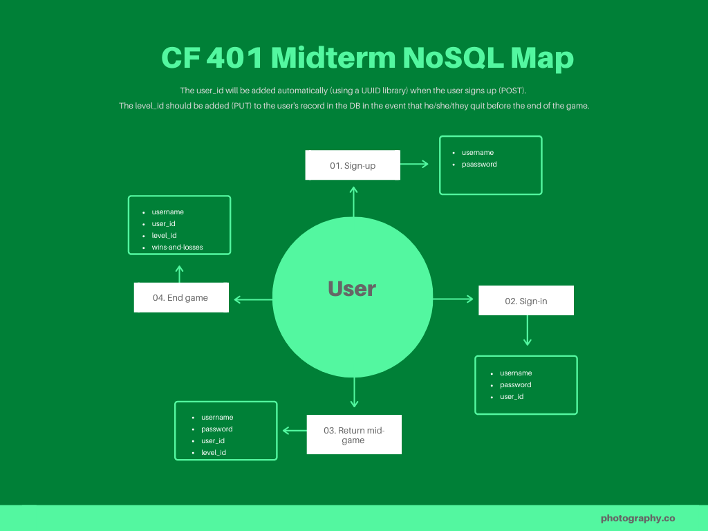

# Title: Code Followers

## Description: 
a text-based, code-or-death, choose-your-own-adventure game for the command line. Wise choices add to the user's score, while poor choices deduct from the user's score.

## Authors:
Garrett Cintron, Nathan Cox, Ashley Moore, Sara Strasner

## Domain Model


## NoSQL Database Map



## Project Management Tool

[Trello Board](https://trello.com/b/FION69R3/codefollowers)

## Deployment

- [NPM package](https://www.npmjs.com/package/code-followers)
- [Heroku Main Deploy](https://code-followers.herokuapp.com/)
- [Heroku Dev Deploy](https://code-followers-dev.herokuapp.com/) 

## How to Play
- Download this repository
   ```sh
   npm i codefollowers
   ```
- Install dependencies
    ```sh
    npm i
    ```
- Start the game
  ```sh
    npm run start
  ```

## Sources
- [Text Adventures by Salif Mehmed](https://github.com/salifm/cli-games/tree/master/TextAdventures)
- [prompts docs](https://github.com/terkelg/prompts#readme)
