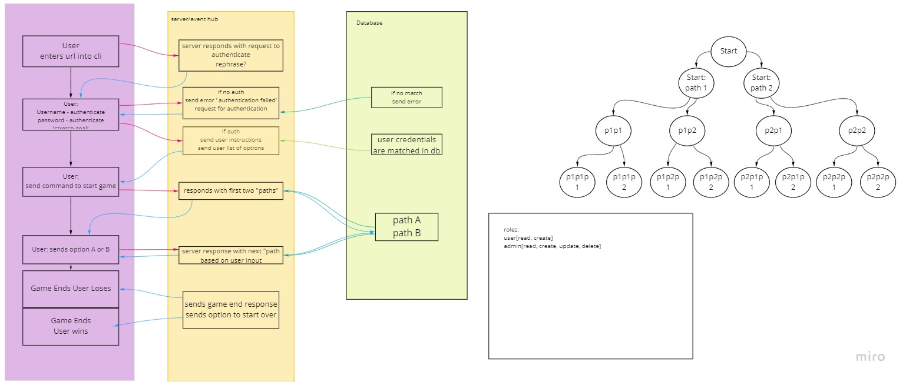

# Software Requirements
## Vision
Codefollowers is a text-based command line game. The user is given a series of prompts and choices, with the goal of making all the right choices and graduating from Code Fellows. This product will provide entertainment and levity for Code Fellows students and will be deployed to `HEROKU` so students can run it and play it at any time. 

## Scope (In/Out)
### IN - What will your product do
- This app will run in the command line, and users will be able to play the game on their own CLI. 
- This app will provide users with a series of scenario-based choices.
- Based on the user"s choice, they will be given a new scenario.
- Incorrent choices will end the game early.
- If a user makes correct choices throughout, they will graduate from Code Fellows, amid much fanfare and celebration. 

### OUT - What will your product not do.
- This app will not have a frontend beyond the CLI.
- This app will not be avaible on mobile devices. 

### Minimum Viable Product
- User is given two option for each scenario
- Incorrect answers end the game
- Correct answers get the user one step closer to graduating from Code Fellows
- Use a binary tree to store/traverse choices
- Store our binary tree in a database(dynamo/dynamoose)
- Query our database for responses

### Stretch
- Traverse back a level/change your choice
- Authorization to save game and come back later
- Create a two-player version of the game using Socket.io
- Publish it to the node store, so someone could download it using npm
- Allowing the user to add a third choice to a given scenario
- CLI formatting (colors, etc.)

## Functional Requirements
1. User initiates the game via the CLI
1. User is given a series of scenarios/prompts
1. Incorrect answers end the game
1. Correct answers continue the game

## Data Flow
Any time a user picks from the two prompts, the database is queried for the appropriate response, which is returned to the user. 

## Non-Functional Requirements (301 & 401 only)
- Testability: We will aim for 90% testing coverage. We will use Jest to test that the correct responses are loading and that the traversal is functional. 
- Usability: The interface will be user-friendly and intuitive, with response options laid out using the node package `prompts`. Users will be able to start this application from the command line using a sigle URL. 
